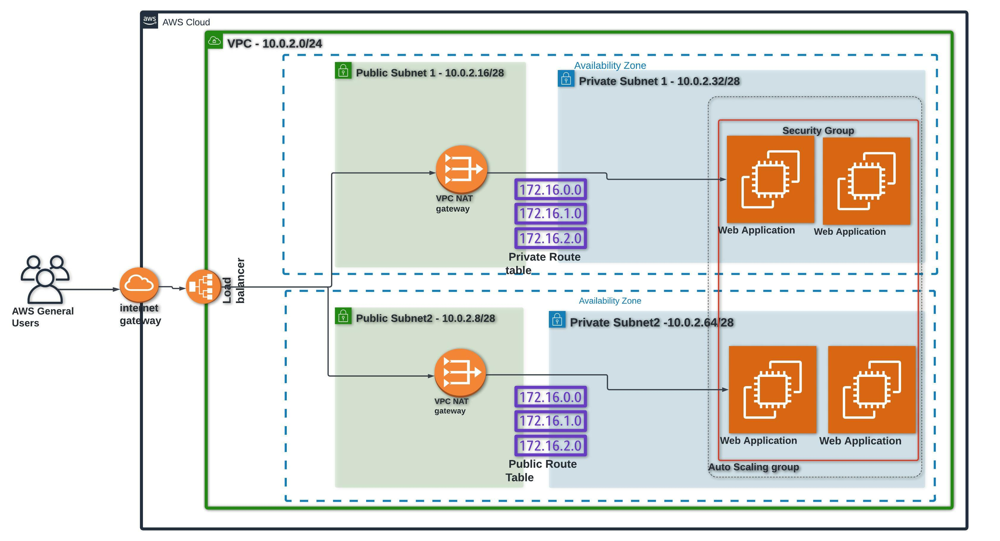

# Jules-Infrastructure-AWS-WebApplication
This project focuses on offering a step-by-step process for building a fault-tolerant Web application architecture on AWS using CloudFormation and the AWS CLI. The scripts are split into two sections: one for establishing the network infrastructure and the other for creating a computing resources.

The Network infrastructure cloudFormation script creates a VPC with a pair of public and private subnets spread across two availability zones. It also creates an Internet Gateway and NAT Gateways for the private subnets, along with the necessary routing and networking configurations. The script also includes parameters for customizing the IP ranges for the VPC and subnets, as well as an environment name for easy identification of resources while the compute cloudFormation script deploys a load balancer and its dependencies needed to host the Jule-web application. The compute template includes security groups, an autoscaling group with its required launch configuration, target groups, and an IAM role for the compute instances.

## Prerequisites
- AWS account with appropriate permissions to create and manage resources
- Iam User with the appropriate Permissions and Programmatic Acess 
- AWS CLI installed and configured with access keys
- AWS CloudFormation templates (Network and Compute)

## File Structure

- `network-infrastructure.yaml`: CloudFormation template for provisioning network infrastructure
- `network-parameters.json`: A sample file containing the parameters for the network infrastructure CloudFormation template
- `compute-infrastructure.yaml`: CloudFormation template for provisioning compute infrastructure
- `compute-parameters.json`: A sample file containing the parameters for the compute infrastructure CloudFormation template
- `AWS CLI commands.txt`: A text file containing example AWS CLI commands for creating the stacks using the provided templates and parameters files
- `Jules.jpeg`: An image file
- `README.md`: This file

## Parameters
- `compute-parameters.json`
- `network-parameters.json`

## Network Script Parameters
- `EnvironmentName`: An environment name that will be prefixed to resource names
- `VpcCIDR`: Please enter the IP range (CIDR notation) for this VPC (default: `192.64.0.0/24`)
- `PublicSubnet1CIDR`: Please enter the IP range (CIDR notation) for the public subnet in the first Availability Zone (default: `192.64.0.8/28`)
- `PublicSubnet2CIDR`: Please enter the IP range (CIDR notation) for the public subnet in the second Availability Zone (default: `192.64.0.36/28`)
- `PrivateSubnet1CIDR`: Please enter the IP range (CIDR notation) for the private subnet in the first Availability Zone (default: `192.64.0.76/28`)
- `PrivateSubnet2CIDR`: Please enter the IP range (CIDR notation) for the private subnet in the second Availability Zone (default: `192.64.0.146/28`)

##  Network Resources
- `VPC`: A VPC with the specified CIDR range
- `InternetGateway`: An Internet Gateway
- `InternetGatewayAttachment`: Attaches the Internet Gateway to the VPC
- `PublicSubnet1`: A public subnet in the first Availability Zone
- `PublicSubnet2`: A public subnet in the second Availability Zone
- `PrivateSubnet1`: A private subnet in the first Availability Zone
- `PrivateSubnet2`: A private subnet in the second Availability Zone
- `NatGateway1EIP`: Elastic IP for the first NAT Gateway
- `NatGateway2EIP`: Elastic IP for the second NAT Gateway
- `NatGateway1`: A NAT Gateway in the first Availability Zone
- `NatGateway2`: A NAT Gateway in the second Availability Zone
- `PublicRouteTable`: A route table for the public subnets
- `PrivateRouteTable`: A route table for the private subnets

##  Compute Resources

The Compute template creates the following resources:

- **UdacityS3ReadOnlyEC2**: An IAM role that allows read-only access to Amazon S3 and full access to Amazon SSM.
- **ProfileWithRolesForApp**: An IAM instance profile that references the UdacityS3ReadOnlyEC2 role.
- **LBSecGroup**: A security group for the load balancer that allows incoming HTTP traffic.
- **WebServerSecGroup**: A security group for the web servers that allows incoming HTTP traffic and allows all outgoing traffic.
- **WebAppLaunchConfig**: A launch configuration for the web servers that includes user data to install Apache and display a "It Works!" message.
- **WebAppGroup**: An autoscaling group that uses the WebApp
LaunchConfig and is associated with the target group.
- **WebAppLB**: A load balancer that forwards incoming HTTP traffic to the web servers.
- **WebAppTargetGroup**: A target group that the load balancer forwards traffic to.

## Usage

To use the template, you will need to have the AWS CLI installed and configured with appropriate credentials.

1. Download the template from the repository.
2. Use the AWS CLI to create a new stack, specifying the template file and any desired parameter values:
3. Monitor the stack creation progress and events using the AWS CLI or the CloudFormation console.

## Note
Please make sure to check and update the parameter values before running the scripts as per your requirement. Also, please update the ami-id as per the region you are running it. Also, You should check the `SecurityGroupIngress` and `SecurityGroupEgress` rules, as the current settings allow all incoming and outgoing traffic on port 80 which may not be appropriate.

## Additional Resources
- [AWS CLI Documentation](https://aws.amazon.com/cli/)
- [AWS CloudFormation Documentation](https://aws.amazon.com/cloudformation/)
- [AWS VPC Documentation](https://aws.amazon.com/vpc/)
- [AWS Security Groups Documentation](https://aws.amazon.com/security-groups/)

## Contributing
If you would like to contribute to this project, please create a pull request with a detailed explanation of your changes.

## License
This project is licensed under the MIT License. See the [LICENSE](LICENSE) file for details.

Time again 
